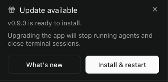
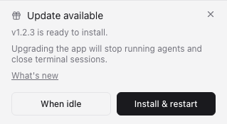
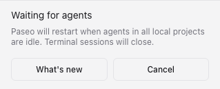

# Restart when agents are idle — review packet

Implementation: [commit e8033a9f8](https://github.com/pieperz/paseo/commit/e8033a9f8694816769eb7fae4c45a69220088506).

Workflow: [discussion #5178](https://github.com/getpaseo/paseo/discussions/5178). Evidence collected on macOS on 2026-09-22 with Codex and Grok 4.7 assistance.

This is a one-time desktop update choice, with Cancel. It checks every project on the local daemon that Desktop owns. Attached daemons and remote hosts retain their existing lifecycle behavior. A persistent auto-update preference is deferred.

## Visual review

| Existing callout (user screenshot) | New option | Waiting with Cancel |
| --- | --- | --- |
|  |  |  |

[Interaction recording](video.webm). New captures use the repository desktop bridge fixture, an isolated real daemon, and synthetic update version 1.2.3. They do not show an installed release update.

## Verification

- 122 unique unit cases across recorded runs: 89 app/helper checks, one subsequently added cancellation-error check, 27 installer checks, and five backend checks. The 44-case final app-model run supersedes those model checks in the earlier 89-case run. Backend filtering skipped 473 unrelated tests.
- 11 renderer checks; the final one-case run re-recorded the cropped screenshots.
- Real macOS Electron lifecycle harness: a busy agent in the second project kept the daemon alive; after cancellation, the idle stop succeeded. Existing attached-daemon, ownership, and slow-launch scenarios also completed.
- `paseo-idle-native-red.log` demonstrates the POSIX lifecycle-RPC bypass before the fix; `paseo-idle-native-green.log` demonstrates the corrected behavior.
- `paseo-idle-service-red.log` / `paseo-idle-service-green.log` cover cancellation before quit-and-install.
- Full workspace typecheck, lint, format and format check completed successfully. No actual release update was installed. Windows/Linux native testing and James's hands-on review remain outstanding.

## Reproduce the changed workflows

Run from the checkout root. Use isolated test homes; do not stop the installed daemon.

```sh
npm run build:server
npm run build:app-deps
npx vitest run packages/app/src/desktop/updates/desktop-app-updater.test.ts packages/app/src/desktop/updates/resolve-update-callout.test.ts --bail=1
npx vitest run packages/desktop/src/features/app-update-service.test.ts --bail=1
npx vitest run packages/server/src/server/daemon-instance.test.ts packages/server/src/server/agent/agent-manager.test.ts packages/client/src/daemon-client.test.ts packages/server/src/server/session.test.ts --testNamePattern='refused lifecycle RPC|idle shutdown claim|onlyIfIdle' --bail=1
npm run test:e2e:renderer --workspace=@getpaseo/desktop -- updates.spec.ts
npm run test:e2e:lifecycle --workspace=@getpaseo/desktop
npm run typecheck
npm run lint
npm run format:check
```

To review interactively without installing an update, run the scheduled-update renderer case with Playwright's `--headed` option. Select **When idle**, confirm **Waiting for agents** stays visible, then select **Cancel** and confirm both install choices return. This uses the test bridge; the native lifecycle harness separately verifies the real daemon shutdown path.

## Raw output

| Check | Output |
| --- | --- |
| App/helper tests, initial run | [89 passed](paseo-idle-app-unit.log) |
| Final app model/callout tests | [44 passed](paseo-idle-app-model-tests.log) |
| Installer tests | [27 passed](paseo-idle-service-green.log) |
| Backend targeted tests | [5 passed, 473 skipped](backend-targeted-tests.log) |
| Renderer | [11 passed](paseo-idle-renderer.log) |
| Final recording capture | [1 passed](paseo-idle-renderer-final.log) |
| Native regression before fix | [Expected failure](paseo-idle-native-red.log) |
| Native lifecycle after fix | [Successful run](paseo-idle-native-green.log) |
| Workspace server build | [Output](paseo-idle-backend-build.log) |
| Full typecheck | [Output](paseo-idle-final-typecheck.log) |
| Full lint | [0 warnings, 0 errors](paseo-idle-final-lint.log) |
| Formatting | [Output](paseo-idle-final-format-check.log) |
